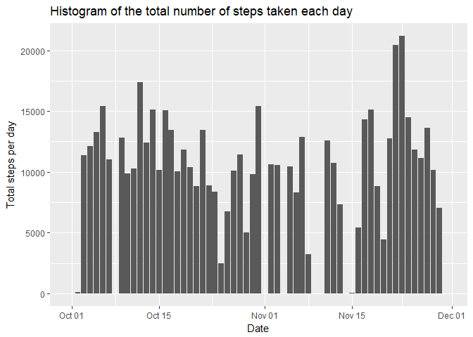
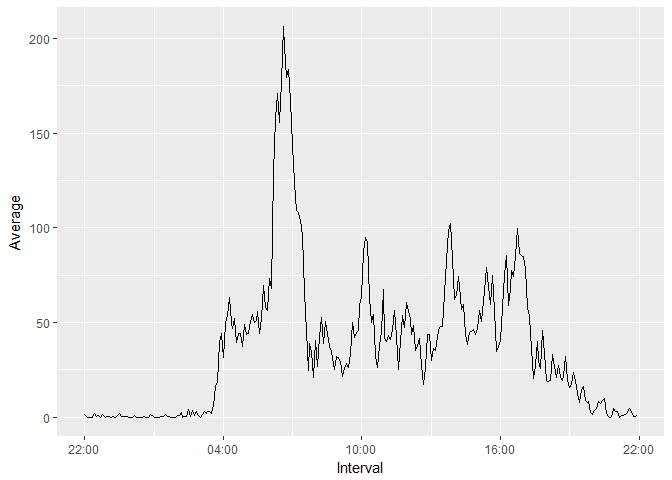
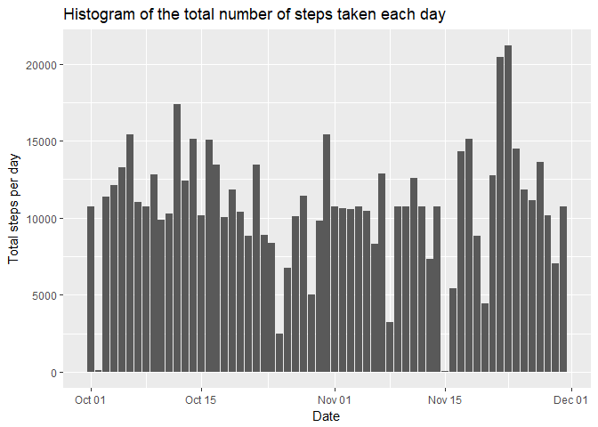
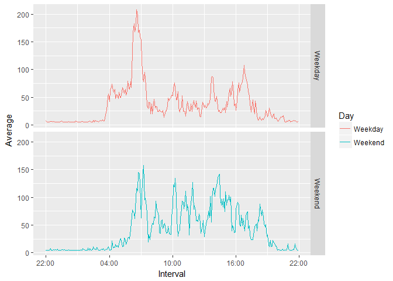

# Reproducible Research: Peer Assessment 1


## Loading and preprocessing the data
1. Load the data (i.e. read.csv())

```r
activity <- read.csv("activity.csv", stringsAsFactors=FALSE)
```
2. Process/transform the data (if necessary) into a format suitable for your analysis  

```r
# Look at data
str(activity)
```

```
## 'data.frame':	17568 obs. of  3 variables:
##  $ steps   : int  NA NA NA NA NA NA NA NA NA NA ...
##  $ date    : chr  "2012-10-01" "2012-10-01" "2012-10-01" "2012-10-01" ...
##  $ interval: int  0 5 10 15 20 25 30 35 40 45 ...
```

```r
# Coerc date variable from character vector to Date 
library(lubridate)
activity$Date <- ymd(activity$date)
# Coerc interval variable from integer vector to time
activity$interval <- sprintf("%04d", activity$interval)
activity$Interval <- as.POSIXct(strptime(activity$interval, format="%H%M"), format = "%H:%M")
head(activity$Interval)
```

```
## [1] "2017-07-01 00:00:00 CEST" "2017-07-01 00:05:00 CEST"
## [3] "2017-07-01 00:10:00 CEST" "2017-07-01 00:15:00 CEST"
## [5] "2017-07-01 00:20:00 CEST" "2017-07-01 00:25:00 CEST"
```


## What is mean total number of steps taken per day?

```r
library(dplyr)
tpd <- activity %>% group_by(Date) %>% summarise(Total=sum(steps, na.rm=TRUE))
tpd
```

```
## # A tibble: 61 x 2
##          Date Total
##        <date> <int>
##  1 2012-10-01     0
##  2 2012-10-02   126
##  3 2012-10-03 11352
##  4 2012-10-04 12116
##  5 2012-10-05 13294
##  6 2012-10-06 15420
##  7 2012-10-07 11015
##  8 2012-10-08     0
##  9 2012-10-09 12811
## 10 2012-10-10  9900
## # ... with 51 more rows
```

```r
library(ggplot2)
g <- ggplot(tpd, aes(Date, Total))
g + geom_col() + labs(y="Total steps per day",
        title ="Histogram of the total number of steps taken each day")
```

<!-- -->

```r
# Mean and median steps taken per day
mean(tpd$Total)
```

```
## [1] 9354.23
```

```r
median(tpd$Total)
```

```
## [1] 10395
```


## What is the average daily activity pattern?

```r
library(scales)
asp <- activity %>% group_by(Interval) %>% 
        summarise(Average=mean(steps, na.rm=TRUE)) %>%
        arrange(Interval)
g <- ggplot(asp, aes(Interval, Average))
g + geom_line() + 
        scale_x_datetime(labels = date_format("%H:%M")) 
```

<!-- -->

```r
# Max average
asp[which.max(asp$Average),]
```

```
## # A tibble: 1 x 2
##              Interval  Average
##                <dttm>    <dbl>
## 1 2017-07-01 08:35:00 206.1698
```

## Imputing missing values

```r
# Total number of missing values 
length(which(is.na(activity$steps)))
```

```
## [1] 2304
```

```r
# Impute missing values by using mean 
library(Hmisc)
activity_imputed <- activity
activity_imputed$steps <- impute(activity_imputed$steps, fun=mean)
# Histogram
tpdi <- activity_imputed %>% group_by(Date) %>% summarise(Total=sum(steps, na.rm=TRUE))
g <- ggplot(tpdi, aes(Date, Total))
g + geom_col() + labs(y="Total steps per day",
        title ="Histogram of the total number of steps taken each day")
```

<!-- -->

```r
# Mean and median steps taken per day
mean(tpdi$Total)
```

```
## [1] 10766.19
```

```r
median(tpdi$Total)
```

```
## [1] 10766.19
```


## Are there differences in activity patterns between weekdays and weekends?

```r
activity_imputed <- activity_imputed %>% 
        mutate(Day = as.factor(ifelse(weekdays(Date) %in% c("Saturday", "Sunday"), "Weekend", "Weekday")))
ai <- activity_imputed %>% group_by(Day, Interval) %>% 
        summarise(Average=mean(steps, na.rm=TRUE))
g <- ggplot(ai, aes(Interval, Average, group = Day, color = Day))
g + geom_line() +
        facet_grid(Day~.) +
        scale_x_datetime(labels = date_format("%H:%M"))
```

<!-- -->
